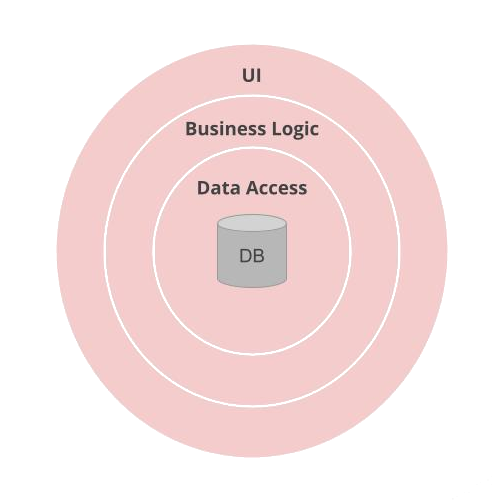

# Arquitectura MVC

## Estructura de paquetes

Se definió la siguiente taxonomía de paquetes:

* **controller:** Contiene las clases que se encargan de mapear y manejar los endpoint http que terminarán ejecutando alguna lógica de negocio. Por lo general tienen alta dependencia de los services
* **service:** Paquete que contiene los Services que contendrán las clases que encapsulan la lógica de negocio necesarias para satisfacer una petición, normalmente desde un controller.
* **repository:** Contiene las clases que se encargan de nutrir de datos a la aplicación, conectándola con bases de datos, apis externas, etc.
* **domain:** Contiene entidades del dominio. Representa el nucleo de toda la aplicación.
* **config:** Capa transversal a toda la aplicación que contendrá las distintas configuraciones y aspectos del bff.
